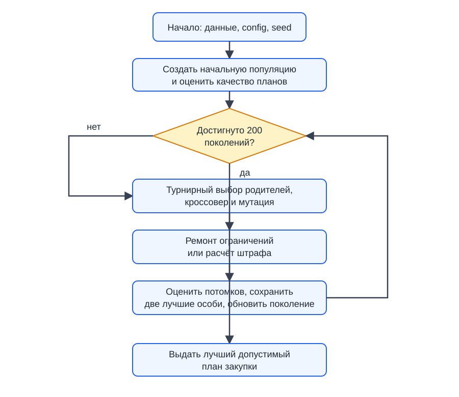
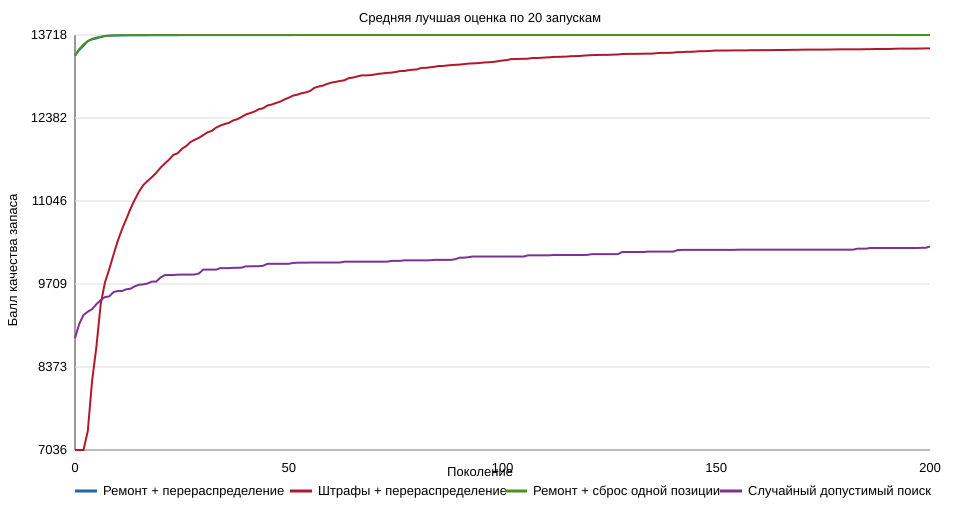

# Отчёт: лабораторная работа № 2

**Вариант 6.** План закупки расходных материалов на месяц при лимите бюджета и минимальных запасах.

## 1. Постановка задачи

Есть 30 видов расходных материалов. Для каждой позиции известны цена единицы, текущий запас, минимально допустимый, желаемый и максимально допустимый запасы, а также приоритет. Нужно выбрать, сколько единиц каждого материала заказать в течение месяца.

Пусть `x_i` — целое число единиц материала `i` в заказе, а `s_i = current_i + x_i` — запас после заказа. Ограничения:

```text
0 <= x_i <= maximum_i - current_i
s_i >= minimum_i
sum(x_i * price_i) <= 95 000 рублей
```

Целевая функция максимизирует качество запаса. До минимального уровня единица имеет вес `5 * priority`, от минимального до желаемого — `10 * priority`, а запас выше желаемого — `1 * priority`. Поэтому алгоритм сначала закрывает обязательные потребности, а оставшийся бюджет стремится вложить в важные материалы и страховой запас.

Данные синтетические. Они сгенерированы скриптом `generate_data.py` с фиксированным seed **2026**. Используются 30 позиций; для обычных материалов цена генерируется в диапазоне 80–550 руб., для двух видов картриджей — 1600–2600 руб. Текущий запас задаётся в диапазоне 0–4, минимальный запас — на 3–7 единиц выше текущего, желаемый — ещё на 3–8 единиц выше минимального, максимальный — ещё на 2–5 единиц выше желаемого, приоритет — от 1 до 10. Бюджет составляет 95 000 руб. Такая генерация позволяет получить воспроизводимый набор данных, не привязанный к одному случайному запуску. Сам набор приложен в [data/materials.json](data/materials.json).

## 2. Представление решения и алгоритм

Генотип — целочисленный вектор из 30 чисел:

```text
[x_1, x_2, ..., x_30]
```

Например, первая координата задаёт число пачек бумаги A4, вторая — число упаковок ручек. Отдельное декодирование не требуется: фенотипом является таблица закупки, где итоговый запас равен текущему запасу плюс соответствующая координата.

Использован генетический алгоритм с максимизацией качества запаса. Родители выбираются турнирной селекцией. Кроссовер равномерный: для каждой позиции потомок берёт количество у одного из двух родителей. В популяции сохраняются две лучшие особи (элитизм).

Основная мутация — **перераспределение**: она снимает от одной до трёх дополнительных единиц с одного материала и добавляет их другому. Такая мутация соответствует предметной задаче: бюджет заказа переносится между позициями. Для сравнения добавлена мутация **сброс одной позиции**, которая случайно выбирает новое количество для одного материала.

Выбор целочисленного вектора непосредственно отражает структуру задачи: каждая координата имеет однозначный предметный смысл — количество единиц конкретного материала, которое закупается. Поэтому равномерный кроссовер сохраняет значения реальных закупочных количеств, а специализированная мутация перераспределения изменяет именно распределение ограниченного бюджета между позициями. Дополнительное декодирование не требуется: вектор заказа напрямую задаёт план закупки.

Параметры приведены в [config.json](config.json).

| Параметр | Значение |
| --- | ---: |
| Размер популяции | 60 |
| Число поколений | 200 |
| Вероятность кроссовера | 0.85 |
| Вероятность мутации | 0.35 |
| Размер турнира | 3 |
| Число элитных особей | 2 |
| Число оценок за запуск | 11 660 |

Число оценок равно `60 + 200 * (60 - 2)`: начальная популяция и новые потомки. Это же число кандидатов проверяет случайный допустимый поиск.

## 3. Обработка ограничений

Сравнивались два способа.

1. **Ремонт.** После создания потомка числа округляются и ограничиваются допустимыми границами. Если бюджет превышен, из заказа по одной убираются дополнительные единицы с наименьшей потерей полезности на рубль. До минимального запаса удаление не допускается. Поэтому после ремонта особь допустима.
2. **Штрафы.** Потомок не ремонтируется. Его приспособленность уменьшается на `10` баллов за каждый рубль превышения бюджета и на `1000` баллов за каждую недостающую единицу. Одна допустимая особь добавляется в начальную популяцию как ориентир; в качестве результата запуска принимается только допустимое решение.

Два допустимых и два недопустимых примера сформированы программой в [outputs/solution_examples.csv](outputs/solution_examples.csv).

| Пример | Стоимость, руб. | Превышение бюджета | Недостаёт единиц | Допустим |
| --- | ---: | ---: | ---: | --- |
| Минимальный допустимый | 70 347 | 0 | 0 | Да |
| Допустимый случайный | 79 099 | 0 | 0 | Да |
| Не хватает бумаги A4 | 70 207 | 0 | 1 | Нет |
| Заказаны все максимальные количества | 196 671 | 101 671 | 0 | Нет |

Полные 30-координатные векторы находятся в этом же CSV-файле.

## 4. Блок-схема алгоритма

Полная блок-схема процесса приведена в [outputs/algorithm_scheme.svg](outputs/algorithm_scheme.svg). Она отражает последовательность: генерация начальной популяции → оценка особей → отбор родителей → кроссовер → мутация → обработка ограничений → формирование следующего поколения с элитизмом → проверка критерия остановки → выбор лучшего допустимого решения.



## 5. Эксперимент

Проведено по 20 независимых запусков с seeds от 1000 до 1019. Сравнения честные: во всех методах проверяется 11 660 кандидатов. Сравнение ремонта со штрафами использует одинаковую мутацию перераспределения. Сравнение мутаций проводится при одинаковом ремонте ограничений.

| Метод | Лучший | Среднее | Медиана | Ст. откл. | Худший | Средняя стоимость |
| --- | ---: | ---: | ---: | ---: | ---: | ---: |
| Ремонт + перераспределение | 13 720 | 13 718.00 | 13 720.00 | 6.16 | 13 700 | 94 966.95 |
| Штрафы + перераспределение | 13 695 | 13 502.75 | 13 572.00 | 176.18 | 13 080 | 94 974.35 |
| Ремонт + сброс одной позиции | 13 720 | 13 718.20 | 13 720.00 | 4.85 | 13 700 | 94 977.45 |
| Случайный допустимый поиск | 10 796 | 10 312.55 | 10 341.00 | 259.15 | 9 820 | 93 547.75 |

Все 20 итоговых решений каждого метода допустимы. Полные результаты приложены в [outputs/experiment_results.csv](outputs/experiment_results.csv), сводная таблица — в [outputs/summary.csv](outputs/summary.csv).

График средней сходимости построен по всем 20 запускам каждого метода:



Таким образом, выполнены обязательные сравнения: два подхода к обработке ограничений («ремонт» и штрафы), два оператора мутации (перераспределение и сброс одной позиции), а также генетический алгоритм сопоставлен со случайным допустимым поиском при одинаковом числе оценок целевой функции.

Лучшее решение найдено методом «ремонт + перераспределение» при seed 1000. Его балл равен **13 720**, стоимость — **94 979 руб.** при бюджете 95 000 руб. Полная понятная таблица закупки по всем 30 материалам приведена в [outputs/best_plan.csv](outputs/best_plan.csv).

## 6. Вывод

Ремонт ограничений оказался заметно надёжнее штрафов: средний результат выше на 215.25 балла, а стандартное отклонение намного меньше. Причина в том, что ремонт не расходует поколения на недопустимые планы и всегда сравнивает реальные варианты закупки.

Две мутации при ремонте дали практически одинаковый средний результат (разница 0.20 балла, что существенно меньше стандартного отклонения). Для этого небольшого набора данных сильный ремонт уже хорошо направляет поиск, поэтому преимущество специализированного перераспределения статистически не проявилось. Оба варианта ГА уверенно лучше случайного поиска: примерно на 33% по среднему баллу.

Лучший план хорош как практический результат: он удовлетворяет всем минимальным запасам и использует бюджет почти полностью, оставляя 21 рубль. Это экспериментальный результат, а не доказанный глобальный оптимум. Ограничения модели: цены и потребности фиксированы, а приоритеты заданы вручную; в реальной закупке их можно заменить данными о фактическом расходе и поставщиках.
